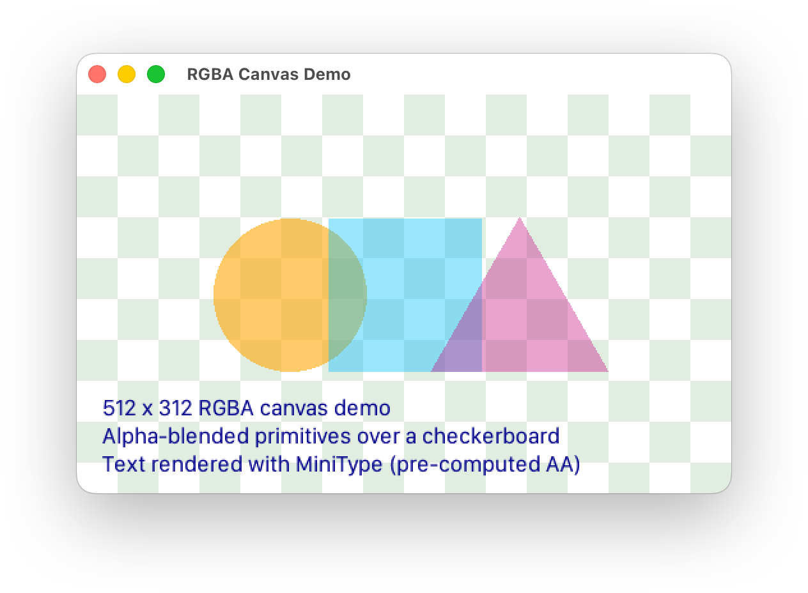

# embedded-rgba

A lightweight, no_std RGBA framebuffer and canvas abstraction for the [`embedded-graphics`](https://github.com/embedded-graphics/embedded-graphics) ecosystem. It adds **alpha blending**, **buffering strategies**, and a practical way to manage drawing pipelines on microcontrollers and resource‑constrained devices.

Check out the [MiniType](http://github.com/dempfi/minitype) for a font format that takes full advantage of RGBA canvas.

## ✨ Features

- ✅ **Alpha blending** – draw `Rgba` pixels onto RGB framebuffers with fast per‑pixel transparency.
- ✅ **Flexible buffering** – choose between **double buffering**, **single buffering**, or **scanline buffering (coming soon)** depending on memory and performance tradeoffs.
- ✅ **Drop‑in integration** with `embedded-graphics`’s `DrawTarget` and `PixelColor`.
- ✅ **No heap allocation** – designed for MCUs without a heap.
- ✅ **Optimized for speed** – fast fill paths and alpha blending.

## 🚀 Usage

### Create a canvas

```rust
use embedded_rgba::Canvas;
use embedded_graphics::mock_display::MockDisplay;
use embedded_graphics::pixelcolor::Rgb565;

let display = MockDisplay::new();

// Create a double buffered canvas
let mut canvas = Canvas::<_, _, {240 * 320}, 240, 320>::double_buffered(display);
// or a single buffer
let mut canvas = Canvas::<_, _, {240 * 320}, 240, 320>::single_buffered(display);
```

### ✨ Draw with Rgba colors

```rust
// `Rgba` is a normal embedded_graphics color
let transparent_orange = Rgba::new(Rgb565::CSS_ORANGE, 128);
let style = PrimitiveStyleBuilder::new().fill_color(transparent_orange).build();
// `canvas.alpha()` is a temporary draw target that can be drawn onto with `Rgba` color
Rectangle::new(Point::zero(), Size::new(50, 50)).draw_styled(&style, &mut canvas.alpha())?;
// Commit the update pixels to the display
canvas.flush().unwrap();
```

## 📊 When to use which buffer?

- **Double buffer** → flicker‑free updates, at the cost of RAM (2 full framebuffers).
- **Single buffer** → less RAM, may tear if drawn while refreshing.
- **Line buffer** → minimal RAM (1 row), best for preplanned scanline rendering.

## 🔮 Roadmap

- [ ] SIMD‑style blending optimizations for all RGB colors
- [ ] Region‑based dirty rectangle updates
- [ ] Line buffer
